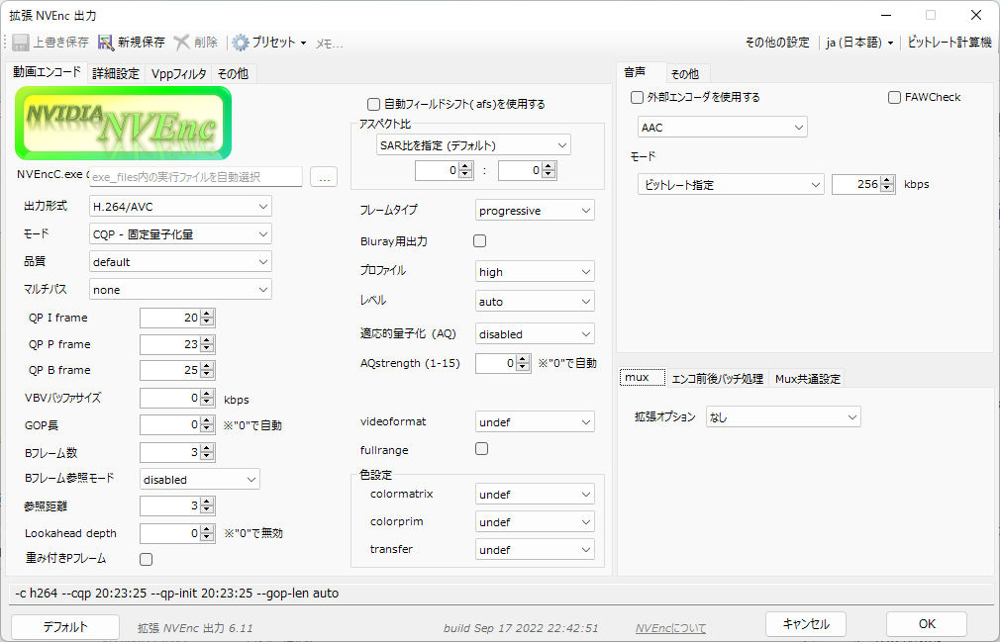

# NVEnc  
by rigaya  

    

このソフトウェアは、NVIDIAのGPU/APUに搭載されているHWエンコーダ(NVENC)の画質や速度といった性能の実験を目的としています。
[Aviutl](http://spring-fragrance.mints.ne.jp/aviutl/)の出力プラグイン版と単体で動作するコマンドライン版があります。  

- NVEncC.exe  
  単体で動作するコマンドライン版です。本項で説明します。

- [NVEnc.auo](./NVEnc_auo_readme.md)  
  NVIDIAのNVEncを使用してエンコードを行う[Aviutl](http://spring-fragrance.mints.ne.jp/aviutl/)の出力プラグインの使用方法については、[こちら](./NVEnc_auo_readme.md)を参照してください。

## 配布場所 & 更新履歴  
[こちら](https://github.com/rigaya/NVEnc/releases)  
  
## インストール
インストール方法は[こちら](./Install.ja.md)。

## ビルド
ビルド方法は[こちら](./Build.ja.md)。

## 基本動作環境  
Windows 10/11 (x86/x64)  
Linux (x64/aarch64)  
[Aviutl](http://spring-fragrance.mints.ne.jp/aviutl/) 1.00 以降 (NVEnc.auo)  
NVEncが載ったハードウェア  
  NVIDIA製 GPU GeForce Kepler世代以降 (GT/GTX 6xx 以降)  
  ※GT 63x, 62x等はFermi世代のリネームであるため非対応なものがあります。  

|NVEnc       |対応するNVENC SDK API|必要なグラフィックドライバのバージョン   |
|:------------- |:------------------ |:--------------------------------------- |
| NVEnc 0.00 以降 | 4.0              | NVIDIA グラフィックドライバ 334.89 以降 |
| NVEnc 1.00 以降 | 5.0              | NVIDIA グラフィックドライバ 347.09 以降 |
| NVEnc 2.00 以降 | 6.0              | NVIDIA グラフィックドライバ 358 以降    |
| NVEnc 2.08 以降 | 7.0              | NVIDIA グラフィックドライバ 368.69 以降 |
| NVEnc 3.02 以降 | 7.0              | NVIDIA グラフィックドライバ 369.30 以降 |
| NVEnc 3.08 以降 | 8.0              | NVIDIA グラフィックドライバ 378.66 以降 |
| NVEnc 4.00 以降 | 8.1              | NVIDIA グラフィックドライバ 390.77 以降 |
| NVEnc 4.31 以降 | 9.0              | NVIDIA グラフィックドライバ 418.81 以降 |
| NVEnc 4.51 以降 | 9.1              | NVIDIA グラフィックドライバ 436.15 以降 |
| NVEnc 5.10 以降 | 9.0 - 10.0       | NVIDIA グラフィックドライバ 418.81 以降 |
| NVEnc 5.18 以降 | 9.0 - 11.0       | NVIDIA グラフィックドライバ 418.81 以降 (x64)   NVIDIA グラフィックドライバ 456.81 以降 (x86) |
| NVEnc 5.24 以降 | 9.0 - 11.0       | NVIDIA グラフィックドライバ 418.81 以降 (x64)   NVIDIA グラフィックドライバ 456.81 以降 (x86) |
| NVEnc 5.36 以降 | 9.0 - 11.1       | NVIDIA グラフィックドライバ 418.81 以降 (x64)   NVIDIA グラフィックドライバ 456.81 以降 (x86) |
| NVEnc 7.00 以降 | 9.0 - 12.0       | NVIDIA グラフィックドライバ 418.81 以降 (x64)   NVIDIA グラフィックドライバ 456.81 以降 (x86) |
| NVEnc 7.26 以降 | 9.0 - 12.1       | NVIDIA グラフィックドライバ 418.81 以降 (x64)   NVIDIA グラフィックドライバ 456.81 以降 (x86) |
| NVEnc 7.49 以降 | 9.0 - 12.2       | NVIDIA グラフィックドライバ 418.81 以降 (x64)   NVIDIA グラフィックドライバ 456.81 以降 (x86) |

| 対応するNVENC SDK API | 必要なグラフィックドライバのバージョン |
|:-------------- |:--------------------------------- |
| 9.0  | NVIDIA グラフィックドライバ (Win 418.81 / Linux 418.30) 以降 |
| 9.1  | NVIDIA グラフィックドライバ (Win 436.15 / Linux 435.21) 以降 |
| 10.0 | NVIDIA グラフィックドライバ (Win 445.87 / Linux 450.51) 以降 |
| 11.0 | NVIDIA グラフィックドライバ (Win 456.71 / Linux 455.28) 以降 |
| 11.1 | NVIDIA グラフィックドライバ (Win 471.41 / Linux 470.57.02) 以降 |
| 12.0 | ??? |
| 12.1 | NVIDIA グラフィックドライバ (Win 531.61 / Linux 530.41.03) 以降 |
| 12.2 | NVIDIA グラフィックドライバ (Win 551.76 / Linux 550.54.14) 以降 |

| CUDAバージョン | 必要なグラフィックドライバのバージョン |
|:------ |:--------------------------------- |
| 10.1    | NVIDIA グラフィックドライバ (Win 418.96 / Linux 418.39)    以降 |
| 10.2.89 | NVIDIA グラフィックドライバ (Win 440.33 / Linux 441.22)    以降 |
| 11.0.2  | NVIDIA グラフィックドライバ (Win 451.48 / Linux 450.51.05) 以降 |
| 11.0.3  | NVIDIA グラフィックドライバ (Win 451.82 / Linux 450.51.06) 以降 |
| 11.1.0  | NVIDIA グラフィックドライバ (Win 456.38 / Linux 455.23)    以降 |
| 11.1.1  | NVIDIA グラフィックドライバ (Win 456.81 / Linux 455.32)    以降 |
| 11.2    | NVIDIA グラフィックドライバ (Win 460.89 / Linux 460.27.04) 以降 |

## NVEncCの使用方法とオプション  
[NVEncCのオプションの説明](./NVEncC_Options.ja.md)

## 各GPUのエンコード機能情報の調査結果  
NVEncC --check-features の結果をまとめたものです。ドライバに問い合わせた結果となっています。そのため、ドライバのバージョンによって結果が異なる可能性があります。 

| GPU世代 | Windows | Linux |
|:---|:---|:---|
| Kepler | [GTX660Ti](./GPUFeatures/gtx660ti.txt) | [Tesla K80](./GPUFeatures/teslaK80_linux.txt) |
| Maxwell | [GTX970](./GPUFeatures/gtx970.txt) | [Tesla M80](./GPUFeatures/teslaM80_linux.txt) |
| Pascal | [GTX1080](./GPUFeatures/gtx1080.txt), [GTX1070](./GPUFeatures/gtx1070.txt), [GTX1060](./GPUFeatures/gtx1060.txt), [GTX1050Ti](./GPUFeatures/gtx1050ti.txt) | [GTX1080](./GPUFeatures/gtx1080_linux.txt) |
| Volta | [GTX1650](./GPUFeatures/gtx1650.txt) | |
| Turing | [RTX2070](./GPUFeatures/rtx2070.txt), [RTX2060](./GPUFeatures/rtx2060.txt), [GTX1660Ti](./GPUFeatures/gtx1660ti.txt), [GTX1650 Super](./GPUFeatures/gtx1650super.txt) | [Tesla T4](./GPUFeatures/teslaT4_linux.txt)  |
| Ampere | [RTX3090](./GPUFeatures/rtx3090.txt), [RTX3080](./GPUFeatures/rtx3080.txt), [RTX3050Ti](./GPUFeatures/rtx3050ti.txt)  | |
| Ada Lovelace | [RTX4090](./GPUFeatures/rtx4090.txt), [RTX4080](./GPUFeatures/rtx4080.txt) | |

## NVEnc 使用にあたっての注意事項  
無保証です。自己責任で使用してください。   
NVEncを使用したことによる、いかなる損害・トラブルについても責任を負いません。 

## 使用出来る主な機能
### NVEnc/NVEncC共通
- NVENCを使用したエンコード
   - H.264/AVC
      - YUV4:4:4対応
   - H.265/HEVC (第2世代Maxwell以降)
      - YUV4:4:4対応
      - 10bit
   - AV1 (Ada Lovelace以降)
- NVENCの各エンコードモード
   - CQP       固定量子化量
   - CBR       固定ビットレート
   - CBRHQ     固定ビットレート (高品質)
   - VBR       可変ビットレート
   - VBRHQ     可変ビットレート (高品質)
- インタレ保持エンコード (PAFF方式)
- colormatrix等の指定
- SAR比指定
- H.264 Level / Profileの指定
- 最大ビットレート等の指定
- 最大GOP長の指定
- ロスレス出力 (YUV 420 / YUV 444)

### NVEnc.auo
- 音声エンコード
- 音声及びチャプターとのmux機能
- 自動フィールドシフト対応

### NVEncC
- cuvidデコードに対応
  - MPEG1
  - MPEG2
  - H.264/AVC
  - HEVC (10bit/12bit YUV4:4:4対応)
  - VC-1
  - VP9
  - AV1
- avs, vpy, y4m, rawなど各種形式に対応
- エンコード結果のSSIM/PSNR/VMAFを計算
- GPUを使用した高速フィルタリング
  - cuvid内蔵のhw処理
    - リサイズ
    - インタレ解除 (normal / bob)
  - CUDAによるGPUフィルタリング
    - rff (rffフラグの適用)
    - インタレ解除
      - afs (自動フィールドシフト)
      - nnedi
      - yadif
    - decimate
    - mpdecimate
    - delogo
    - 字幕焼きこみ
    - 色空間変換 (x64版のみ)
      - hdr2sdr
      - lut3d
    - リサイズ  
      - bilinear
      - spline16, spline36, spline64
      - lanczos2, lanczos3, lanczos4
      - nppライブラリによる各種アルゴリズム (x64版のみ)
      - nvvfx-superres
    - 回転 / 反転
    - パディング(黒帯)の追加
    - フレーム間引き(select every)
    - バンディング低減
    - ノイズ除去
      - smooth (dctベースのノイズ除去)
      - denoise-dct (dctベースのノイズ除去)
      - knn (K-nearest neighbor)
      - pmd (正則化pmd法)
      - gauss (nppライブラリ、x64版のみ)
      - convolution3d
      - nvvfx-artifact-reduction
      - nvvfx-denoise
    - 輪郭・ディテール強調
      - unsharp
      - edgelevel (エッジレベル調整)
      - warpsharp

## マルチGPU環境でのGPU自動選択

NVEncCでは、NVENCを実行可能なGPUが複数存在する場合、
指定されたオプションをもとに実行時に最適なGPUを自動選択します。
自動選択に任せず、自分でGPUを選択する場合には--deviceオプションで指定してください。

1. 指定オプションを実行可能なGPUを選択  
  指定されたオプションから下記をチェックします。  
  - 指定されたコーデック、プロファイル、レベルのサポート
  - 下記を指定した場合、それをサポートしているかチェック
    - 10ビット深度
    - ロスレス
    - インターレース保持
    - psnr/ssim/vmaf計算時のHWデコード
  
2. 指定オプションを満たすGPUを優先  
  下記条件のチェックし、実行可能なGPUを優先します。  
  - Bフレームの使用が指定された場合、Bフレームのサポート
  
3. 1と2の条件を満たすGPUが複数ある場合、下記のGPUを優先して自動選択します。  
  - Video Engine(VE)使用率の低いもの
  - GPU使用率の低いもの
  - GPUの世代の新しいもの
  - GPUのCUDAコア数の多いもの
   VE/GPU使用率の低いGPUで実行することで、複数のGPUを効率的に使用し、エンコード速度の最大限引き出します。また、一般に世代が新しく、CUDAコア数の多いGPUのほうが高速であると考えこれを優先します。
  
  なお、VE/GPU使用率の取得はエンコードの開始時に行われ、その値には数秒のタイムラグがあるため、
  エンコードをほぼ同時に複数開始すると、複数のエンコードが同じGPUに割り当てられてしまうことが
  多いのでご注意ください。

## NVEncのソースコードについて
- MITライセンスです。
- 本プログラムは、NVIDA CUDA Samplesをベースに作成されており、NVIDIA CUDA、[NVIDIA Video Codec SDK](https://developer.nvidia.com/video-codec-sdk)、[NVIDIA Optical Flow SDK](https://developer.nvidia.com/optical-flow-sdk)のサンプルコードを含みます。  
  This software contains source code provided by NVIDIA Corporation.  
- --vpp-nvvfx フィルタは、NVIDIA BROADCASTを使用しています。
  
- 本ソフトウェアでは、
  [jitify](https://github.com/NVIDIA/jitify),
  [ffmpeg](https://ffmpeg.org/),
  [vmaf](https://github.com/Netflix/vmaf),
  [tinyxml2](http://www.grinninglizard.com/tinyxml2/),
  [dtl](https://github.com/cubicdaiya/dtl),
  [libass](https://github.com/libass/libass),
  [ttmath](http://www.ttmath.org/),
  [Caption2Ass](https://github.com/maki-rxrz/Caption2Ass_PCR)を使用しています。  
  これらのライセンスにつきましては、該当ソースのヘッダ部分や、NVEnc_license.txtをご覧ください。

### ソースの構成
Windows ... VCビルド  

文字コード: UTF-8-BOM  
改行: CRLF  
インデント: 空白x4  
